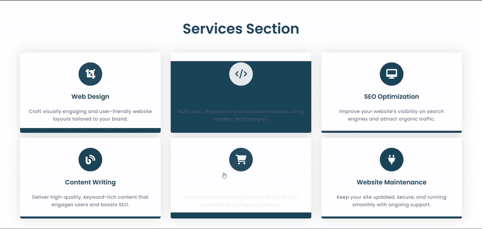
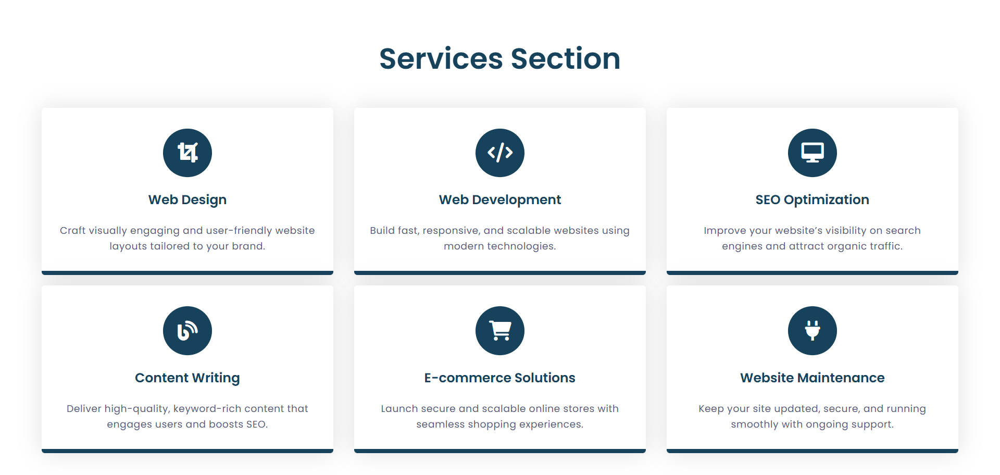
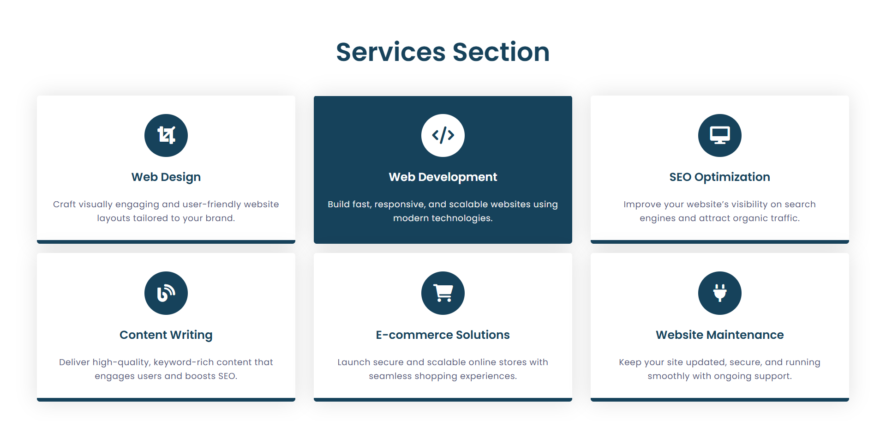
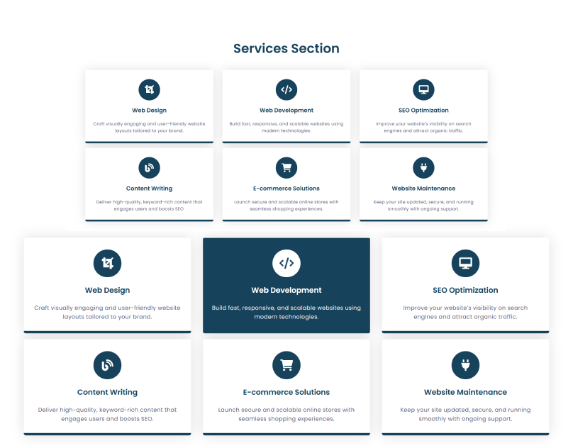

# HoverHub services with interactive hover effects 🌐

> A sleek, responsive web template designed to showcase services with interactive hover effects, icons, and modern styling.

## 🚀 Project Overview

**HoverHub** is a modern landing page template built for web development agencies, freelancers, or digital service providers. It features a clean layout, service cards with icons, and hover effects that enhance user engagement.

---
#### 🧑‍💻 Author
Virendra D. Verma
<a href="https://www.linkedin.com/in/dharmendraverma95/" target="_blank">LinkedIn Profile </a> | <a href="https://www.behance.net/dhirukumar" target="_blank">Behance Profile </a>
---

## 🧩 Features

- 🎨 UI/UX Focused Service Cards
- ⚙️ Clean, Responsive Flex Layout
- 🌈 Smooth Hover Effects (Background & Text Color)
- 💻 Simple HTML & CSS (no frameworks)
- 🔄 Easy to Customize and Extend

---

## 📌 Technologies Used
- HTML5
-CSS3
- Emojis for icons (can be replaced with Font Awesome or SVGs)

 
Desktop Design 

 
Desktop Design  

 
Desktop Hover Effect Design 

 
Cover 
